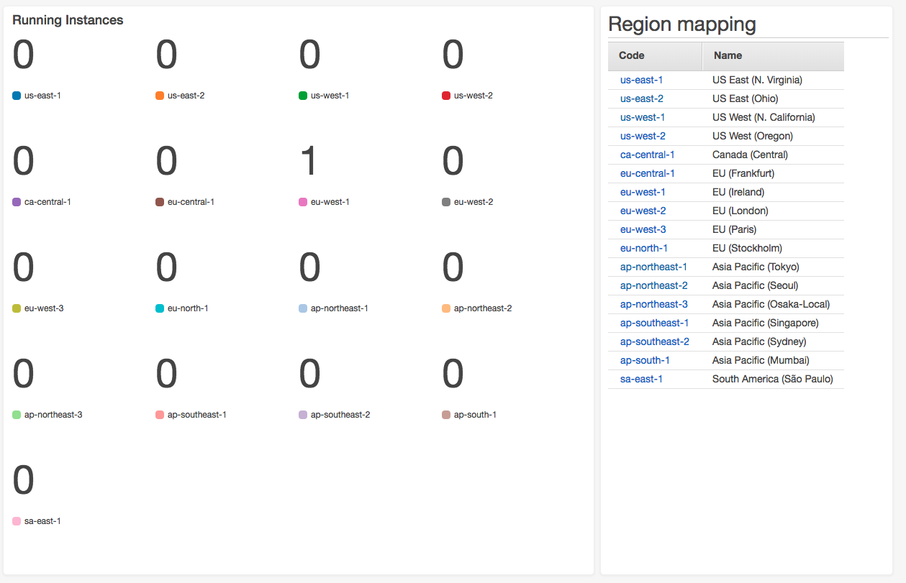
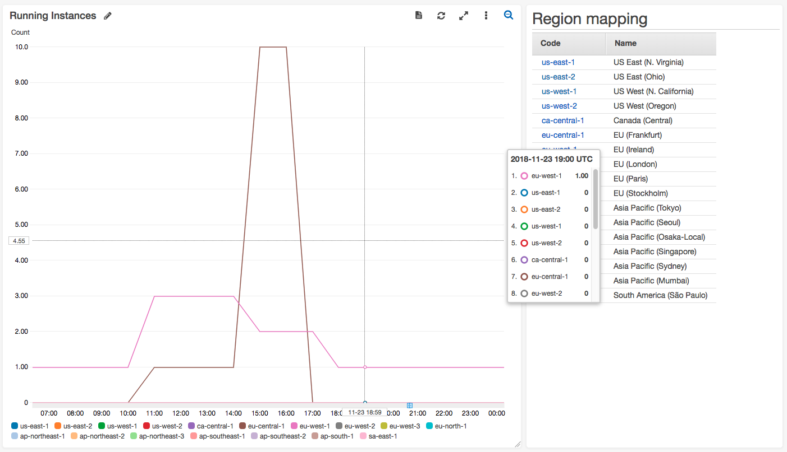

# Amazon EC2 Global Dashboard

Monitor how many EC2 instances are running across all regions with a simple dashboard.

### Details

Amazon EC2 Global Dashboard is created with a CloudFormation template. All elements of the dashboard are handled by the CloudFormation stack.

The goal of the dashboard is to give insight over all regions for how many instances are currently in a running state and monitor usage. With the overall goal of keeping costs down and helping monitor your account.

The dashboard is populated by a Lambda function counting instances in a running state in each region and pushing them to CloudWatch as custom metrics. The stack can be created in any region.

Resources created by CloudFormation:
- AWS::CloudWatch::Dashboard       
- AWS::IAM::Role
- AWS::Lambda::Permission               
- AWS::Lambda::Function  
- AWS::Events::Rule

### Setup

1. Save the file called 'amazon-ec2-global-dashboard.json' locally
2. Go to CloudFormation in your AWS management console
3. Select 'Create Stack' ->  'Template is ready' -> 'Upload a template file'
4. Upload 'amazon-ec2-global-dashboard.json' -> Next
5. Give it a name -> 'Next'
6. No requirements on the *Configure stack options* page -> 'Next'
7. On the *Review* page you must accept the acknowledgment to allow the stack to create an IAM Role -> 'Create stack'

### Widgets

The Dashboard contains two widgets:
- **Running Instances** - Dynamic widget showing the number of running instances and historical data.
- **Region mapping** – Maps the region name with the region code and hyperlinks to the instances in each region.

The ‘Number’ widget type will show the current number of running EC2 instances, this is the default view:

The ‘Line’ widget type will show historical data:

## License Summary

This sample code is made available under the MIT-0 license. See the LICENSE file.
